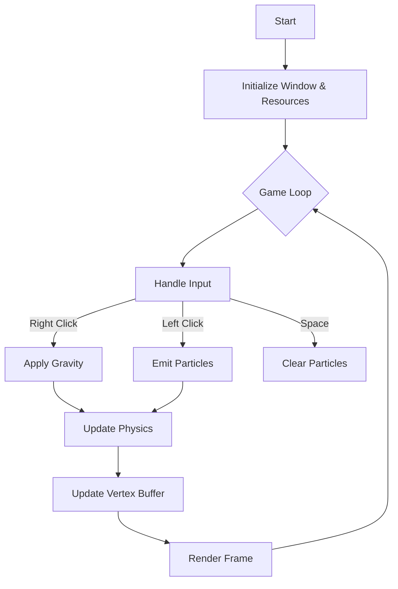

# SFML Gravity Simulation


A high-performance 2D particle simulation engine built with C++ and SFML. This project demonstrates efficient rendering of massive particle systems using `sf::VertexBuffer` and simulates gravitational physics in real-time.

## 🌟 Features

- **High-Performance Rendering**: Utilizes `sf::VertexBuffer` for efficient GPU rendering, capable of handling a large number of particles smoothly.
- **Interactive Physics**: Real-time gravitational interaction controlled by user input.
- **Visual Effects**: Additive blending (`sf::BlendAdd`) creates beautiful, glowing visual effects as particles overlap.
- **Dynamic Coloring**: Particle colors evolve over time based on simulation duration.

## 🛠 Architecture

The simulation loop processes user input, updates particle physics on the CPU, and renders the result using OpenGL-based Vertex Arrays via SFML.



## 🚀 Getting Started

### Prerequisites

- **Visual Studio** (Project solution is provided as `.sln`)
- **SFML 2.5+** (Libraries are included in the repository, but ensuring a valid environment is recommended)

### Installation & Build

1.  Clone the repository:
    ```bash
    git clone https://github.com/yourusername/SFML-Gravity-simulation.git
    ```
2.  Open `SFML.sln` in Visual Studio.
3.  Ensure the build configuration is set to **Release** or **Debug** (x64/x86 depending on your SFML DLLs).
4.  Build and Run the project.

> **Note**: The required SFML DLLs (`sfml-graphics-2.dll`, `openal32.dll`, etc.) are located in the project directory. Ensure the working directory is set correctly in Visual Studio if you encounter "DLL not found" errors.

## 🎮 Controls

| Input | Action |
| :--- | :--- |
| **Left Mouse Button** | **Emit Particles**: Spawns 1000 particles at the mouse cursor. |
| **Right Mouse Button** | **Attract**: Activates a strong gravitational pull towards the cursor. |
| **Space Bar** | **Reset**: Clears all particles from the screen. |
| **ESC** | **Exit**: Closes the application. |

## 📸 Demo

*(Click the image below to watch the video)*

[](https://youtu.be/GAwqau3vBMc)

---

## 📝 License

This project is open-source and available under the MIT License.